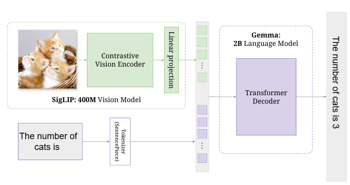

# PaliGemma: A Research-Oriented Multimodal Vision–Language Model
<p align="center">
  
</p>

**Figure 1 | PaliGemma’s architecture: a SigLIP image encoder feeds into a Gemma decoder LM**
 <br><br>
This repository contains my clean, modular **re-implementation of PaliGemma**, a vision–language model architecture that integrates a **SigLIP vision encoder** with a Gemma-based language model to enable grounded multimodal reasoning. 
My primary aim in this project was to **study the internal mechanisms** of large VLMs by recreating their major components from scratch in PyTorch while keeping the codebase accessible for further experimentation.

## Table of contents
- []()


## 1. Research Motivation

Current multimodal models must efficiently align visual representations with language signals while remaining scalable and sample-efficient. PaliGemma offers a compelling design: a powerful transformer-based vision encoder, a lightweight yet expressive decoder-only language model, and a simple projection mechanism for cross-modal fusion.

**This implementation allowed me to investigate core research questions such as:** <br> 
How do contrastive vision models like SigLIP integrate with decoder-only LMs? <br> 
What is the minimal architecture required for high-quality VQA and captioning? <br> 
How do positional embeddings, attention mechanisms, and KV caching behave in multimodal generation? <br> 
What trade-offs arise between architectural simplicity and model expressivity? <br> <br> 

This repository reflects my attempt to answer these questions through a modular and transparent codebase.

## 2. High-Level Architecture

PaliGemma follows a straightforward yet effective design:


### **Key Components** <br>

**SigLIP Vision Encoder:** Produces semantically rich patch embeddings through a sigmoid-based contrastive training objective. <br>
**Multimodal Projection Layer:** Maps visual representations into the language embedding space.<br>
**Gemma Language Model:** A decoder-only transformer with grouped-query attention, RoPE, and SwiGLU feed-forward networks.<br>
**Autoregressive Generation:** Supports efficient KV caching and multiple decoding strategies.<br>

## 3. Model overview
PaliGemma has three components:<br>
SigLIP Vision Encoder (ViT-So400m) contrastively pretrained, produces patch tokens.<br>
Linear Multimodal Projector  projects SigLIP outputs into Gemma’s embedding space (zero-init linear layer). Simplicity here was found advantageous.<br>
Gemma Decoder-only LM (Gemma-2B) autoregressive language model that consumes image tokens + text prompt and produces text outputs.<br>
High-level token layout:<br>
 [ image_tokens ... , BOS, prefix_text_tokens..., SEP, suffix_tokens..., EOS, PAD ] image tokens are placed at the front and the model uses block attention (image + prefix full, suffix autoregressive).

## 4. Repository Structure


Each module is designed for readability and extensibility, enabling future research on architectural variants, training strategies, and fine-tuning methods.

## 5. Component Overview

### Vision Encoder (SigLIP)

**Implemented from first principles, including:**
-  Patch embedding layers
-  Multi-head attention blocks
-  MLP feed-forward sublayers
-  Sigmoid-based contrastive alignment (conceptual basis)

### Language Model (Gemma)

**Key design elements:**
-  Grouped-query attention for memory efficiency
-  Rotary positional embeddings
-  RMSNorm normalization
-  SwiGLU MLP layers
-  Autoregressive LM Head for generation

### Multimodal Projector
**A lightweight linear layer that aligns visual patch embeddings with the text embedding space.**
### Input Processing
-  Image resizing, rescaling, and normalization
-  Special token handling (<image> tokens)
-  Unified tokenizer and processor for multimodal prompts

## 6. Running Inference
### Basic Example
```bash
python main.py
```

### Custom Inference Script
```Python
from inference import load_hf_model, test_inference
from processing import PaliGemmaProcessor
import torch

model, tokenizer = load_hf_model("./paligemma-3b-pt-224", "cuda")
processor = PaliGemmaProcessor(tokenizer, model.config.vision_config.num_image_tokens,
                               model.config.vision_config.image_size)

with torch.no_grad():
    test_inference(
        model=model,
        processor=processor,
        prompt="Describe this image",
        image_file_path="./your_image.jpg",
        max_tokens_to_generate=100,
        temperature=0.8,
        top_p=0.9,
        do_sample=True
    )
```

## 7. Key Research Features
### Attention Mechanisms
  -  Grouped-query attention significantly reduces memory overhead while maintaining high-quality attention maps.  <br>
### Cross-Modal Alignment
-  Investigates how a simple linear projector can effectively fuse modalities without complex fusion layers.  <br>
### Autoregressive Behavior
-  KV caching enables efficient, scalable token generation. <br>
-  Multiple decoding strategies (greedy, temperature, top-p) allow comparative experiments.

### Architectural Transparency
-  Every component is implemented with clarity to support reproducibility and ablation studies.


## 8. Configuration

You can adjust model behavior in ```main.py```:
```Python
model_path = "./paligemma-3b-pt-224"
prompt = "Describe this image"
image_file_path = "./image.jpg"
max_tokens_to_generate = 500
temperature = 0.2
top_p = 0.7
do_sample = False
```

## 9. System Requirements
-  Python 3.8+
-  PyTorch 2.0+
-  Transformers
-  PIL
-  NumPy
-  SafeTensors
-  HuggingFace Hub

**See requirements.txt for full version details.**
 
